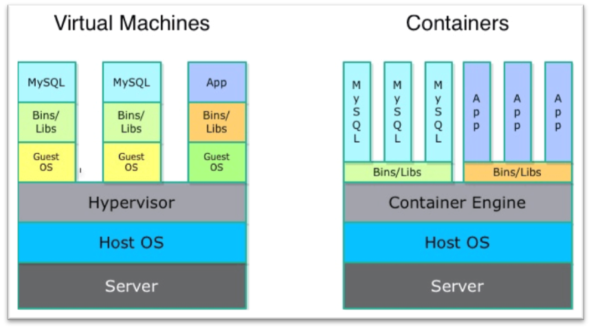
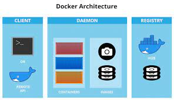

<h1 align="center">
Docker
</h1>

<br />

Let's talk about Docker and Containers, what are containers?
why are we using them? what is Docker? How does Docker manage
containers? And how we can create our own containers with Docker?

<br />

## What are containers?

Containers are lightweight packages of your application code 
together with dependencies such as specific versions of 
programming language runtimes and libraries required to run 
your software services.

<p align="center">
    
</p>

<br />

Containers require less system resources than traditional or 
hardware virtual machine environments because they don't 
include operating system images. 
Applications running in containers can be deployed easily 
to multiple different operating systems and hardware platforms.

## What is Docker?

Docker is an open source platform that enables developers 
to build, deploy, run, update and manage containers—standardized, 
executable components that combine application source code with 
the operating system (OS) libraries and dependencies required to 
run that code in any environment.

<p align="center">
    
</p>

### Principles

- **Image**: A Docker image is a file used to execute code 
in a Docker container. Docker images act as a set of 
instructions to build a Docker container, like a template.
- **Dockerfile**: Is used to create docker images.
- **Container**: Each container is build from a docker image.
- **Registry**: A simple example is Dockerhub.

### Image layers

Layers allow you to work with Docker images faster. 
This is because the builds avoid unnecessary steps, 
and the pulling and pushing of images skips the transfer 
of a large unchanged amount of data already available in 
the intended destination.

<p align="center">
    
</p>

### Where are containers on my system stored?

#### Linux

```shell
/var/lib/docker
```

#### MacOS

```shell
~/Library/Containers/com.docker.docker/Data/vms/0/data/Docker.raw
```

<br />

## Presentation

- Containers
  - cgroups
  - namespace
  - runC
- Docker
  - image
  - container
  - dockerfile
  - commands
  - network
  - volume
  - example

## Resources

- [https://hub.docker.com](https://hub.docker.com/)
- [https://www.docker.com](https://www.docker.com/)
- [https://www.netapp.com](https://www.netapp.com/devops-solutions/what-are-containers/#:~:text=Benefits%20of%20containers,-Containers%20are%20a&text=Containers%20require%20less%20system%20resources,t%20include%20operating%20system%20images.&text=Applications%20running%20in%20containers%20can,operating%20systems%20and%20hardware%20platforms.)
